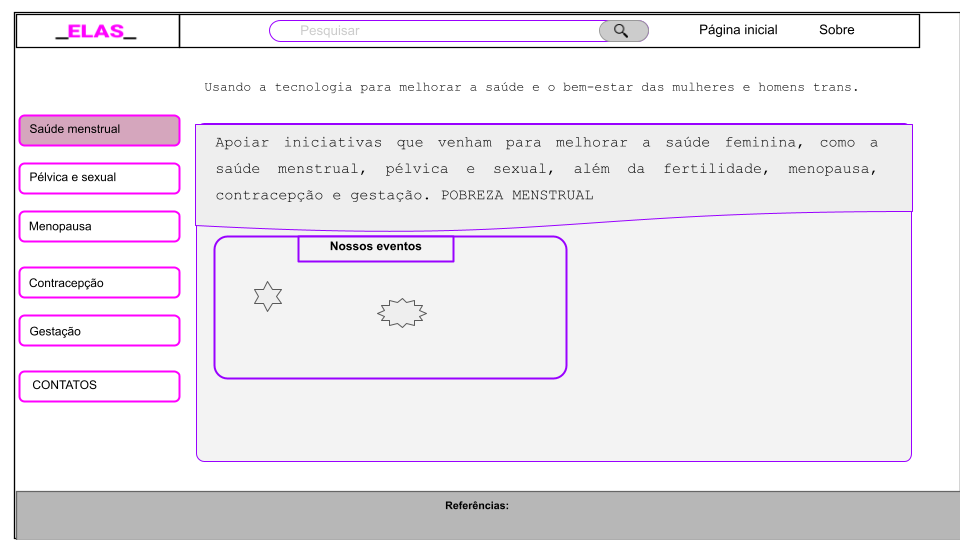
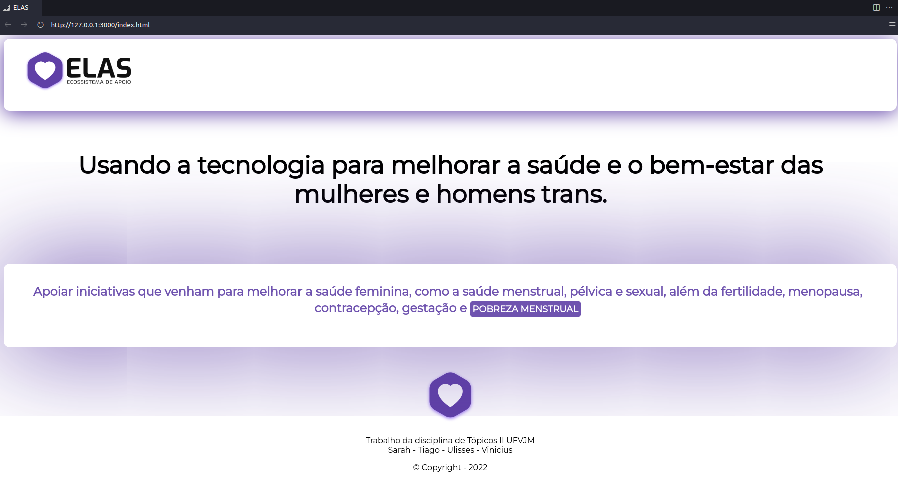
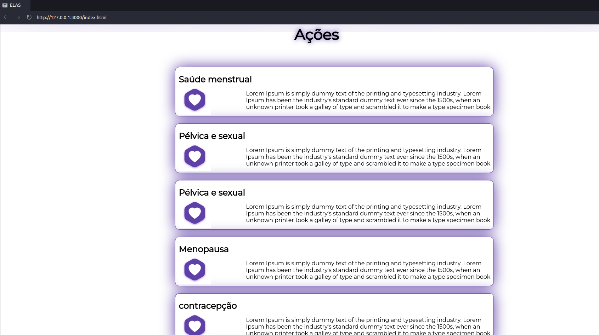

## Usando a tecnologia para melhorar a saúde e o bem-estar das mulheres e homens trans.

Projeto da disciplina Tópicos Especiais de Informação II 

**Docente:** Ana Carolina Rodrigues

**Discentes:** Sarah Galiciolli, Tiago Mercês, Ulisses Xavier e Vinicius Soares. 

Acessem: [GitHubPages - ELAS](https://tiagomerc.github.io/ELAS/)
_______________

#### Objetivo: 

Apoiar iniciativas que venham para melhorar a saúde feminina, como a saúde menstrual, pélvica e sexual, além da fertilidade, menopausa, contracepção e gestação. **POBREZA MENSTRUAL**

 É fundamentada no empreendedorismo social que utiliza técnicas de gestão, inovação, criatividade, sustentabilidade e outras com o propósito de maximizar o capital social de uma comunidade, bairro, cidade ou mesmo país. Os empreendedores sociais (líderes de impacto social) buscam transformar o mundo e melhorar a vida das pessoas utilizando métodos geralmente presentes no cotidiano das mesmas e respeitando o seu contexto. 

#### Esboço da home

#### Primeiro esboço da home

#### Atualizando página dia 10/06/22

#### Atualizando página dia 10/06/22

